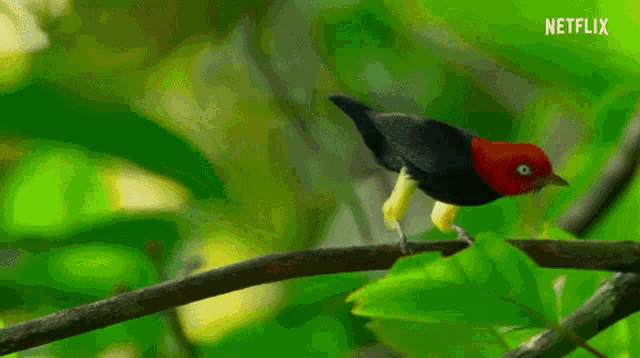

# Bad Dance Moves Are Just Good Dance Moves You Haven't Seen In The Mirror Yet

I'm going to share with you some radical beliefs. Radical beliefs about dancing. If they have a gravestone for me, please put the title of this article on it. It is the most important thing that I have learned in life.

Here is the first radical belief: Everyone needs to dance. It is *vital* that we dance. I cannot prove this, but I believe it is in our DNA. That is not outlandish, many creatures dance. Humans didn't invent dance, it is a gift we inherited. 

So, there you are, this complex organism with metabolic needs and limited resources and you live in a world with many other creatures, and some of them want to eat you. Why would you spend precious energy, time, and attention on busting a dance move? How does it help our survival or the survival of our DNA?

For one thing, some of the side-effects of dancing include attracting a mate. This might be the first place your mind went, mine too. Although it is one of my favorite reasons, it gets too much hype, and maybe that is why some people think dancing isn't for them. Dancing is so much more, especially to human creatures. 

This leads us to my personal favorite reason for dancing: fun. It's so hard to imagine the experience of that lovely bird moonwalking across the branch. But we can imagine the human experience very well. Dancing is the most accessible way to feel the most alive that we can feel. You can basically do it anytime, if you need to, and there is no upper limit on the amount of joy or release it can bring. You can do it sitting down at work (especially when you just had a good idea), waiting for the bus, listening to music in your car, walking into the grocery store.

What does fun bring us? Emotional release, connection to others, affirmation, motivation and energy to engage with life. That's a very important question and it will have to be another article.

There are many other obvious benefits of dance, artistic and experiential. Too many to list here. But what are some of the less obvious benefits?

Dance provides an opportunity for mindfulness and embodiment. It's not always something we need to do, but it is there if we want it. To help me explain, let me share my personal history of dance.

---

In my home, growing up, we danced with wild abandon. Not most of the time, of course. Our home was often a very gloomy and serious place. There was often a lot of tension in the air, and it was not always a safe place to be. But when my parents would leave we would have these crazy dance parties. We would just go wild, to the point where it might not have been recognizable as dancing. I believe dancing sustained us through an otherwise difficult time by providing all those benefits we just explored. No one benefits more than someone who is under a lot of stress.

But after childhood, I pretty much stopped dancing. Most of my life, I have been an overweight, very awkward computer nerd. The truth is that I was not the kind of person most people want to see dancing. I understood this by the way they looked at me when I danced and by way they told me to stop dancing.

So why do I dance even though I am very awkward? That almost sounds like torture. Well, that might actually be part of it. But more importantly it is because I know a secret about dancing: it is not the source of the awkwardness, it is how you shed awkwardness. You start out feeling awkward and by the time you are done dancing you don't care. 

Is it possible that other people around you might still feel awkward? I can tell you from experience: it is possible. Another important thing that I have learned in life is that sometimes we can't do very much about what other people think. No need to put that on my gravestone too, we are running out of room. 

And yet, I care about what other people think enough to do something that is actually very important for other reasons: I try to dance well. This means I have to focus my mind on my movement and my body and the moment. Something magical happens when you do these things together, it invites a good feeling. My insides just feel good. I believe it is the feeling of tension being released, muscles and organs realizing they don't have to work so hard. 

You can't try too hard, that just invites the tension back. If you look cool even just 10% of the time, that's pretty cool. Just through luck, some people will only look at you during those moments, and you will seem unusually awesome. My advice is to aim for 10% of the time, and anything you score above that is a bonus. Of course, no one is keeping track. Yet. I mean we have the technology and the cameras everywhere, just saying. 

You can always just dance by yourself too, and I highly recommend it. I'm focusing on dancing where other people can see you because we spend so much of our lives around other people, and that is a good thing. We should feel free to dance around others. So why don't we? I believe it has to do with the issue of conformity and bullying, a deep and sticky topic that I will save for another time.

---

Dancing is an emotional expression. Emotions aren't just processed in the head, they are processed all over the body. Let me tell you about my experience of dancing. 

The will to dance starts spontaneously because the emotional response to the song has become significant enough that it can no longer be contained in my head (which is even pretty large) and it must flow to the rest of my body or be limited. 

In order to even begin to dance well -- as a reminder, that is all we are aiming for -- we must learn to let go of tension in the body. Stiffness is the enemy of beautiful dancing, unless that is actually the style.^ Remember how emotions are processed all over the body? You could think of stiffness as emotions that leaked out of your head and got stuck somewhere in your body and now they just need a little shimmy and they will be on their way. This stiffness could be in your neck, in your shoulders, lower back, basically anywhere. To let it go, first we must find it.

As you begin to move, let the initial movement be like a body scan to identify points of tension. Movement is easiest when we are also breathing. As obvious as that seems, I forget sometimes. So first I find a nice, steady, slow breath, exactly as deep as feels comfy. It feels comfy when you reach the top or the bottom of a breath, the way a good stretch feels comfy. Each breath finds a slightly deeper stretch, until it fits exactly with what your body and mind need in the moment.

Start by swaying and notice where the center of gravity goes within your body. Imagine the center of gravity is a ball that begins to move freely along a smooth and steady path that you decide, no longer tethered to your center. Notice how it feels as it moves through each part of your body, bouncing softly here and there. Does it flow through some areas with more difficulty? You've found a point of stiffness.

^ That's the funny thing about tension and stiffness: sometimes leaning into it lets you regain control and then release it, if that is what you wish.

Sometimes the wish to relax is not enough, the stiffness has a hold. Let your mind play with it like a puzzle as you sway around it. Maybe there is another point of stiffness, and you finally find the one you need to let go first and the rest fades away in a cascade of wellness. Sometimes it appears somewhere else and it is a little like hide and seek. 

Now your muscles are warmed up and you are starting to have a little fun. It just feels good. You must look really cool right now, because this feels just right. You see the reflection of yourself dancing in the bus window and you realize that even though the stiffness is gone and it feels great, the dancing looks a little silly, even by your standards.

Is this a bad dance move? I would argue no, because I don't equate silly with bad. But maybe silly is just another way of saying that it isn't what you were aiming for. And we are aiming for 10%!

So what is a good dance move, anyway? 