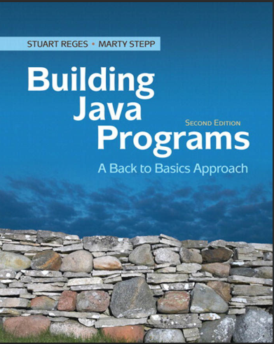

# Kotlin is Cozy

I had a strange and probably unfounded concern that if I published an article about coding on my blog, I would lose my audience (as if you would ever leave me). 

But that is a huge part of my life, coding. Although I enjoy collaborating, I've yet to find people who want to work on the same projects. I'm sure those people out there exist and I want to find them. In the meantime, I'm coding alone.

I sometimes imagine myself alone, on a spaceship, living up in space with just my work and my plants. I could travel or just orbit a planet and do all my work and my daydreaming. I even started a game in this spirit called *Make it So*. 

    
    

I was just thinking about how that's not so far from the truth. We are floating in space, the spaceship is just very very big. I think about that when I wake up at 3 A.M. and I watch Vega transit across the viewport/sky outside my window. It's the only star bright enough to see in that direction, but you only really need one star. 

I've made a long journey in coding. When I was maybe 12 I got a book from the library that game entire programs written in BASIC and I would copy them out line by line. One of them was even a flight simulator where horizon was represented by a line of asterisks. 

So I suppose you could say my first coding language was BASIC, and then many years later I learned Java. I learned it from a lovely book called Building Java Programs. It is a playful introduction to the object-oriented philosophy of coding and thinking about problems like a programmer. I admired the elegance in that way of thinking. If there is anything programmers love most, it is *elegance.* It was fun. It made difficult problems seem possible. It made me feel powerful.

My first real projects were games created with Unity. I used C#, a language very similar to Java. I felt like an alchemist. I'd lay in bed at night and imagine things to put in my game and then challenged myself the next day to make it. I learned that I could create anything that I could imagine.

The first game I made was called Canniballs, where you could control or manage colorful spheres that rolled around and interacted and hunted cube creatures called Hexamon. 

    
    

A few very noteworthy people have made quite a success at solo indie game development, but I haven't yet. I love diving into the details of certain aspects of the game but creating a cohesive and engaging experience for a player has been a challenge. I tend to lose track of the goal of making a game for another person to enjoy, spending too much time on features and implementations that tease my brain.

I knew there were many aspects to software development that I needed to learn and I thought I should try making apps. I turned to the dotnet ecosystem for PC apps, which was a natural place to turn after becoming very familiar with C#. PC Apps are a dying market, some might say, and I dabbled in Android development. That was never very exciting for me because I prefer the experience of a desktop or a laptop to working on a mobile device. 

For years now, I've been looking for a cross-platform development experience that I enjoy. I finally believe I found one with Compose Multiplatform. I can write the entire codebase in Kotlin, cross-platform app development and the app server and all supporting libraries, all as modules within the same project.

Kotlin is the sparkling unicorn of programming languages. It is designed to be very concise and very readable. It has all the features that I love, strict types and null safety. It has every object-oriented programming feature you could want, and every functional programming feature you could want. The ecosystem is developed by my favorite IDE maker, Jetbrains. I have warm fuzzy feelings for this company, which is rare.

I feel a little like a weary traveler that has found a new place to explore, one that feels like it could be home. I'm not sure I'll ever make a proper income doing it, because I have a gut sense that working for a company would be a terrible mistake for me. I am a part of several developer communities and I hear quite a lot about other developers experiences with work. 

I have a crude theory about work and fun, based on my studies as a psychology researcher. In school I was particularly interested in work and the problem of maintaining energy and motivation. I believe that money, as a reinforcement, can eventually eclipse your original motivation. It is too tempting to do some things the profitable way if it is different from the fun way or the way that is good for people, developers or users. I don't trust companies to balance these concerns. I think my motivation to code could actually survive a decent paycheck, but it definitely wouldn't survive working on a project I don't believe in.

I also have several big projects that I don't think anyone will make unless I make them. For example, I am making an app that I hope will be useful to buskers and people looking for an open mic. It will let a musician track where they have played and what kind of response they received there, and aggregate this information. There are a few apps that already do this but they seem to be languishing in various states of neglect or just aren't used where I live. 

I would also like to create a journaling app, something to track life in a particular way that I know would be useful for me. All the journaling / lifelogging apps and techniques that I have used quickly become tedious. Data entry becomes a chore. Rather than fill out forms or enter data into spreadsheets, I think it would be better to gather data using an AI that can check in with me on various metrics throughout the day. It seems unwise to trust what would be a treasure-trove of personal information to a company. Rather than expect users to trust me, I can provide the server program or cloud storage options.

These projects, among others, are basically my bucket list. Some time ago I realized that my best chance for leaving something behind, for having the impact that I wish to have, is through software. Software development is the wild frontier and it has shaped our culture in a big way. The giants in the tech world have shown us that nearly every time they have a choice between profits and the wellbeing of people, they will choose profits. Eventually it seems inevitable.

We live in a moment where solo developers and small teams have never been more empowered. The last few decades have been a steady march to this point, as the landscape of IDEs and software development tools and libraries has matured. With the introduction of modern AI, we take another quantum leap forward. 

At the same time, the current moment economically speaking is much more precarious than it was a couple decades ago. I don't pretend to have a good understanding of it, but it seems like where I am standing they are just shoveling everything they can to feed the hungry flames of capitalism and they are running out of fuel. We seem ready to abandon some of our best ideas as a community, like open source and the collaborative spirit that once seemed so robust.

There are few hills I would die on, few ships I would ride to the bottom of the ocean. It is not because I do not have convictions, I have too many. It is because I know I can only ride once. I would proudly die on the hill of Open Source. And by that I mean work until I am old and have lost the ability to understand my own code, which already happens sometimes but that is normal. Of all the hills to die on, it seems particularly pleasant.

I support this wild scheming through freelance work, and increasingly, playing music. Part of my weakness and strength as a person comes from my habit of falling in love with ideas. One idea that plucks at my heart is supporting my software developer side-gig as a musician. This comes from a strange part of me that is slightly bitter at our culture for prioritizing wealth above all things. It makes me want to support myself making something that has value that isn't easy to compensate financially. 

In terms of important jobs that you don't get paid for, I suppose the most noteworthy example is parenthood. I would have loved to have kids, but that wasn't in the cards for me. But I still believe this bigness of spirit is what pushes us forward, and I would like to do my part, in some form. Maybe is creating software that is good for people, or creating music that becomes a part of a happy moment in someone's day.

Tangents:

* [Dear Reader](dear-reader.md)
* [Pearl Street](pearl-street.md)